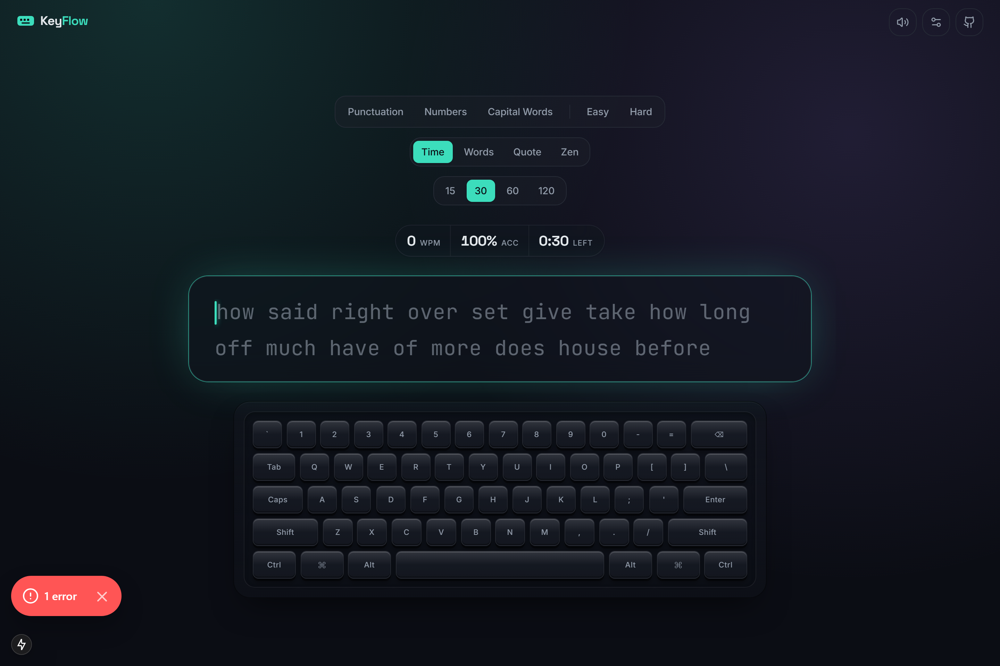

<a id="readme-top"></a>

<div align="center">

<picture>
  <source media="(prefers-color-scheme: dark)" srcset="assets/logo-dark.svg">
  <source media="(prefers-color-scheme: light)" srcset="assets/logo-light.svg">
  
</picture>

<br>

A fast, minimal, local-first typing speed test.

<!-- Hero screenshot placeholder — replace with assets/screenshots/home.png -->


<br><br>

[](https://keyflow-tau.vercel.app/)
[](https://github.com/PawanChoudhary0607/KeyFlow)
[](https://github.com/PawanChoudhary0607/KeyFlow/issues/new?template=bug_report.md)
[](https://github.com/PawanChoudhary0607/KeyFlow/issues/new?template=feature_request.md)

<br>

[](./LICENSE)
[](https://github.com/PawanChoudhary0607/KeyFlow/stargazers)
[](https://github.com/PawanChoudhary0607/KeyFlow/network/members)
[](https://github.com/PawanChoudhary0607/KeyFlow/issues)
[](https://github.com/PawanChoudhary0607/KeyFlow/commits/main)
[](https://www.typescriptlang.org/)
[](https://vercel.com)
[](./LICENSE)

</div>

---

## Table of Contents

- [About](#about)
- [Features](#features)
- [Screenshots](#screenshots)
- [Demo](#demo)
- [Tech Stack](#tech-stack)
- [Project Structure](#project-structure)
- [Getting Started](#getting-started)
- [Roadmap](#roadmap)
- [Contributing](#contributing)
- [Deployment](#deployment)
- [License](#license)
- [Author](#author)
- [Support](#support)
- [Star History](#star-history)

---

## About

KeyFlow is a typing speed test built for people who want to practice
without friction. There is no account to create, no server storing
your results, and no clutter between you and the keyboard. Every
setting and every result lives entirely in your browser.

It exists because most typing test sites have accumulated years of ads,
trackers, and unrelated features on top of a simple idea: type text,
measure how well you did. KeyFlow strips that back down.

It is built for touch typists practicing speed and accuracy, developers
who want a distraction-free daily warm-up, and anyone who wants a
typing test they can read the source code of.

<div align="right"><a href="#readme-top">Back to top</a></div>

## Features

**Typing**

- Time Mode — 15, 30, 60, or 120 second sessions
- Word Mode — 10, 25, 50, or 100 word sessions
- Quote Mode — short, medium, or long quotes
- Zen Mode — untimed, endless practice with no target

**Statistics**

- Words per minute (WPM) and raw WPM
- Accuracy
- Consistency
- Mistake count
- Character count, broken down by correct, incorrect, and extra

**Customization**

- Twelve color themes
- Fourteen typing fonts across monospace and sans-serif
- Light, dark, and system appearance modes
- Keyboard sounds, including a real mechanical switch recording set
- An animated on-screen virtual keyboard

**Open Source**

- MIT licensed
- Open to community contributions
- Structured issue templates for bugs and feature requests
- Public roadmap

<div align="right"><a href="#readme-top">Back to top</a></div>

## Screenshots

| | |
|---|---|
| **Homepage** <br> `assets/screenshots/home.png` | **Typing Screen** <br> `assets/screenshots/test.png` |
| **Settings** <br> `assets/screenshots/settings.png` | **Results** <br> `assets/screenshots/results.png` |
| **Dark Theme** <br> `assets/screenshots/dark-theme.png` | **Light Theme** <br> `assets/screenshots/light-theme.png` |

> Screenshot files are not yet included in this repository. See
> [`assets/screenshots/README.md`](./assets/screenshots/README.md) for
> the exact filenames expected above.

<div align="right"><a href="#readme-top">Back to top</a></div>

## Demo

<!-- Demo GIF placeholder — replace with assets/demo.gif -->


> A short screen recording of a typing session belongs at
> `assets/demo.gif`. Not included yet — see
> [`assets/screenshots/README.md`](./assets/screenshots/README.md).

<div align="right"><a href="#readme-top">Back to top</a></div>

## Tech Stack

- [Next.js](https://nextjs.org) — React framework, App Router
- [React](https://react.dev)
- [TypeScript](https://www.typescriptlang.org)
- [Tailwind CSS](https://tailwindcss.com)
- [Framer Motion](https://www.framer.com/motion/) — animation
- Browser `localStorage` — the only persistence layer; no database, no backend

<div align="right"><a href="#readme-top">Back to top</a></div>

## Project Structure

```
keyflow/
├── app/
│   ├── page.tsx               # Home page — the typing experience itself
│   ├── results/page.tsx       # Results page
│   ├── layout.tsx             # Root layout: fonts, providers
│   └── globals.css            # Design tokens and global styles
├── components/
│   ├── typing/                # Typing engine UI: words, caret, keyboard, controls
│   ├── results/                # Stat cards, WPM chart, results summary
│   ├── settings/                 # Settings panel, theme and font pickers
│   ├── layout/                     # Top bar, logo
│   ├── providers/                    # Theme and settings context providers
│   └── ui/                             # Shared primitives: button, card, sheet, tabs
├── hooks/
│   ├── use-typing-engine.ts   # Core typing and scoring state machine
│   ├── use-keyboard-sound.ts  # Sound engine (sprite and sample based)
│   ├── use-focus-mode.ts      # Idle and focus-mode timing
│   └── use-key-tracker.ts     # Physical key state for the virtual keyboard
├── lib/                        # Word lists, quotes, stats math, storage, themes, fonts
├── types/                       # Shared TypeScript types
├── public/sounds/                # Keyboard sound assets
└── assets/                        # README screenshots and demo GIF (this repo, not the app)
```

<div align="right"><a href="#readme-top">Back to top</a></div>

## Getting Started

### Prerequisites

- Node.js 18.18 or later
- npm (or your package manager of choice)

### Clone

```bash
git clone https://github.com/PawanChoudhary0607/KeyFlow.git
cd KeyFlow
```

### Install

```bash
npm install
```

### Configure (optional)

```bash
cp .env.example .env.local
# set NEXT_PUBLIC_GITHUB_URL to your fork's URL if you're publishing your own copy
```

### Run

```bash
npm run dev
```

Open [http://localhost:3000](http://localhost:3000).

### Build

```bash
npm run build
npm run start
```

### Deploy

See [Deployment](#deployment).

<div align="right"><a href="#readme-top">Back to top</a></div>

## Roadmap

**Current version:** v1.0.0

Planned for future releases:

- Achievements
- User profiles
- Multiplayer typing races
- Typing history and progress tracking
- Custom theme builder
- Additional sound packs
- Performance analytics
- Plugin system

See [CHANGELOG.md](./CHANGELOG.md) for what has already shipped, and
open [issues](https://github.com/PawanChoudhary0607/KeyFlow/issues) for
discussion on any of the above.

<div align="right"><a href="#readme-top">Back to top</a></div>

## Contributing

Contributions are welcome. The general workflow:

1. Fork the repository
2. Create a branch (`git checkout -b feat/short-description`)
3. Commit your changes (`git commit -m "feat: add short description"`)
4. Push to your fork (`git push origin feat/short-description`)
5. Open a pull request against `main`

Please read [CONTRIBUTING.md](./CONTRIBUTING.md) for coding conventions
and [CODE_OF_CONDUCT.md](./CODE_OF_CONDUCT.md) before contributing.

<div align="right"><a href="#readme-top">Back to top</a></div>

## Deployment

KeyFlow is a standard Next.js application and deploys to
[Vercel](https://vercel.com) with no additional configuration:

1. Push this repository to GitHub
2. Import it in the [Vercel dashboard](https://vercel.com/new)
3. Set the `NEXT_PUBLIC_GITHUB_URL` environment variable if you want the
   in-app GitHub button to point at your fork
4. Deploy

Any other Node.js hosting platform that supports Next.js (`npm run
build` followed by `npm run start`) works as well.

<div align="right"><a href="#readme-top">Back to top</a></div>

## License

Distributed under the MIT License. See [LICENSE](./LICENSE) for details.

The Mechanical sound pack includes third-party audio used under the
Apache License 2.0 — see
[THIRD_PARTY_NOTICES.md](./THIRD_PARTY_NOTICES.md).

<div align="right"><a href="#readme-top">Back to top</a></div>

## Author

**Pawan Choudhary**

- GitHub: [@PawanChoudhary0607](https://github.com/PawanChoudhary0607)
- LinkedIn: `add your LinkedIn URL here`
- Portfolio: `add your portfolio URL here`

<div align="right"><a href="#readme-top">Back to top</a></div>

## Support

If KeyFlow is useful to you, consider leaving a star. It helps the
project reach more people and is a quick way to show support.

<div align="right"><a href="#readme-top">Back to top</a></div>

## Star History

<a href="https://star-history.com/#PawanChoudhary0607/KeyFlow&Date">
  <picture>
    <source media="(prefers-color-scheme: dark)" srcset="https://api.star-history.com/svg?repos=PawanChoudhary0607/KeyFlow&type=Date&theme=dark" />
    <source media="(prefers-color-scheme: light)" srcset="https://api.star-history.com/svg?repos=PawanChoudhary0607/KeyFlow&type=Date" />
    
  </picture>
</a>

<div align="right"><a href="#readme-top">Back to top</a></div>
